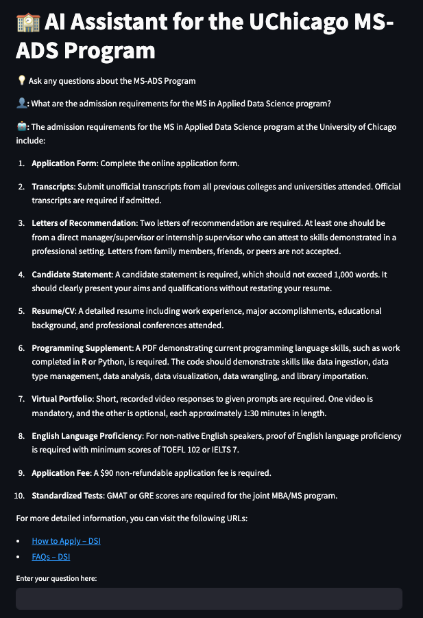

# RAG-based-Interactive-AI-for-MSADS

This project developed a chatbot, using Retrieval-Augmented Generation (RAG), that can answer questions about the University of Chicago’s MS in Applied Data Science program website.

Team Members: Daichi Ishikawa, Liang Gong, Haoran Zheng

- **User Interface:** [https://rag-uchicago-website.streamlit.app/](https://rag-uchicago-website.streamlit.app/)

# Main Architecture

Through the use of metadata-driven routing and RAG fusion techniques, we achieved high performance in question answering.

!(images/main_architecture.png)
